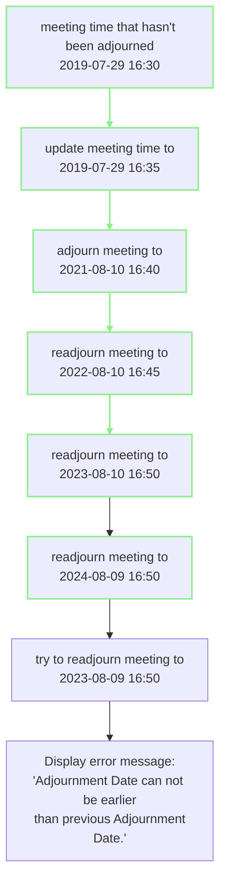

```mermaid
flowchart TD

%% NODES %%
1[meeting time that hasn't been adjourned\n2019-07-29 16:30] -->
2[update meeting time to\n2019-07-29 16:35] -->
3[adjourn meeting to\n 2021-08-10 16:40 ] -->
4[readjourn meeting to\n 2022-08-10 16:45 ] -->
5[readjourn meeting to\n 2023-08-10 16:50 ] -->
6[readjourn meeting to\n 2024-08-09 16:50 ] -->
7[try to readjourn meeting to\n 2023-08-09 16:50 ] --> 8[Display error message:\n'Adjournment Date can not be earlier\n than previous Adjournment Date.']

%% LINKS %%

%% STYLES %%
linkStyle 0,1,2,3 stroke:#90EE90,stroke-width:2px
style 1 stroke:#90EE90,stroke-width:2px
style 2 stroke:#90EE90,stroke-width:2px
style 3 stroke:#90EE90,stroke-width:2px
style 4 stroke:#90EE90,stroke-width:2px
style 5 stroke:#90EE90,stroke-width:2px
style 6 stroke:#90EE90,stroke-width:2px
```
