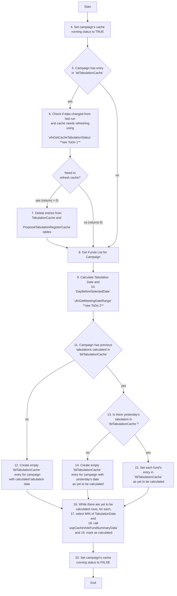

## ToDo List:
1. check if `ufnGetCacheTabulationStatus` ever returns that cache needs refreshing (returns `> 0`) 
	1. it might always be returning `0`, which causes older entries in `tblTabulationCache` entries to not be deleted when refreshing cache
2. In `ufnGetMeetingDateRange`, what is `CTEDateRange`?
## Flowchart of UspCacheTabulationByCampaignId

