## TLDR
- Shares voted:  
	- For an individual proposal 'x':
		- Total shares voted from both Registered TFile and the Broker File
	- For security summary,
		- Total shares voted from Registered TFile and max(Total shares voted) from broker vote
## Questions
- What are routine and non-routine proposals?
## ToDo List:
%% 1. check if `ufnGetCacheTabulationStatus` ever returns that cache needs refreshing (returns `> 0`) 
	1. it might always be returning `0`, which causes older entries in `tblTabulationCache` entries to not be deleted when refreshing cache
2. how does `ufnGetMeetingDateRange` work? %%
## Flowchart of UspCacheVoteFundSummaryData

```mermaid
flowchart TD

	%% NODES %%
	1[1. Get SecurityProposalMappings]
	2[2. Get QuorumThresholdPercentage \n from vwProposal]
	3[3. Calculate ProposalPassingCalculationType Count]
	4[4. Store SecuritySummaryData]
	5[5. Select RSHs where Disposition Codes\n  match and only select the latest BLFinishedOn Date]
	6[6. Mark all votes as Duplicate except the latest one]
	7[7. Get shares from vwREGShareholder]
	8[8. Select votes for all selected \nshareholders on each proposals]
	9[9. Collect RSH Details]
	10[10. Collect RSH Vote Summary including SharesVoted]
	11[11. Populate FundID in RSH Vote Summary]
	12{12. If OfficialBroker}
	13[13. Collect Broker and Proposal \n info from `Regular` Broker Tables]
	14[14. Collect Broker and Proposal \n info from `Projected` Broker Tables]
	15-1[15-1. Update Official BrokerVoteDetails]
	15-2[15-2. Update Projected BrokerVoteDetails]
	16[16. Update selected broker vote's ProposalPassingCalculationType Count]
	17[17. Calculate Max Routine Proposal votes\n and Min Non-Routine Proposal Votes]
	18[18. Calculate Broker Non-Vote]
	19[19. Collect all RSH Votes and Broker Votes into @ActualVote]
	20[20. Set votes = 0 for null SecurityIDs in @ActualVote]
	21[21. Sum all votes, broker votes and broker non-votes into @SecurityVoteSummary]
	22[Step 22 skipped in SP]
	23{23. If ShareChangeSince\n was enabled}
	24{24. If votes both before and after \n`ShareChangeSince` time exists}
	25[25. Store all RSH details\n and votes for votes cast\n before `ShareChangeSince`]
	30{30. If only votes before\n `ShareChangeSince` time exists}
	32{32. If only votes after\n `ShareChangeSince` time exists }

	%% LINKS %%
	start[Start] --> 
	1 --> 2 --> 3 --> 4 --> 5 --> 6 --> 7 --> 8 --> 9 --> 
	10 --> 11 --> 
	12 -- yes --> 13 --> 15-1 --> 16
	12 -- no --> 14 --> 15-2 --> 16
	16 --> 17 --> 18 --> 19 --> 20 --> 21 --> 22 --> 23
	23 -- no --> ?
	23 -- yes --> 
	24 -- yes --> 25 --> 35
	24 -- no --> 30 -- no --> 32
	finish[End]
```

- - -

- - -
## Related stories:
1. AP20-2016: Meeting Summary - table
2. AP20-2202:[Enabler] Meeting Summary - chart (Data preparation)
3. AP20-2110:Meeting Summary - basic chart (dynamic data integration)
4. AP20-2165:Meeting Summary - chart filtering (Development Only) 
